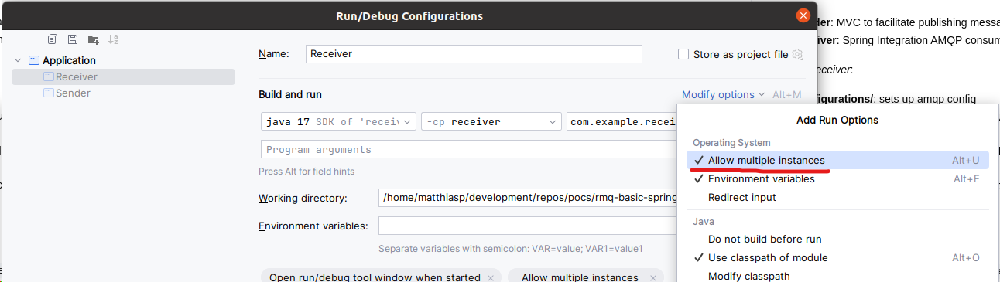

# Shutdown Concurrency BUG

## Repository structure

Modules:
- **sender**: MVC to facilitate publishing messages. May be ignored.
- **receiver**: Spring Integration AMQP consumer of events.

Module _receiver_:
- **configurations/**: sets up amqp config
- **configurations/AmqpConfigurationExclusiveConsumer.java**: configures the queue that will be used for exclusive consumer example
- **configurations/AmqpConfigurationSingleActiveConsumer.java**: configures the queue that will be used for Single Active Consumer example
- **flows/Flow.java**: Integration Flow that processes messages

## Setup

- Start a clean instance of RabbitMQ. `docker-compose.yml` is provided to facilitate this; use `docker-compose up -d`.
- Base `pom.xml` file can be used to select Spring version (flip commented out code)
- `Exclusive consumer failure:` etc logs are expected. Spring Integration AMQP repeatedly attempts to register exclusive consumer even if there is aleady an exclusive consumer.

## Replication Steps

1. Start 1 instance of sender (Sender.java). 
2. Start 2 instances of receiver (Receiver.java).
   * You may need to allow multiple instances in your IDE. Example IntelliJ:
3. Login to rabbitmq at http://localhost:15672. Username/password: `guest`
4. Navigate to http://localhost:15672/#/queues and select appropriate queue
   * `sac.queue` when testing Single Active Consumer
   * `exclusive.consumer.queue` when testing exclusive consumer
4. Publish Messages to RMQ. You may use provided API endpoints in sender module to publish 20 messages at once.
   * Either Single Active Consumer: `GET: localhost:8080/publish/sac`
   * Or Exclusive Consumer: `GET: localhost:8080/publish/exclusive`
5. Trigger graceful shutdown of active consumer. (The first instance of `receiver` you started)
   * IDE shutdown button. Alternative on linux: `ps aux | grep receiver` to get process id. `kill -INT <process_id>`
   * Note that a forceful shutdown will NOT cause the bug.
6. Watch logs of both `receiver` applications
   * Message processing has a 10-second sleep to ease replication.
   * Notice as both instances are processing messages in parallel
7. Optional: Watch queue in RMQ dashboard
   * may also be used to purge messages after test

Alternative: Instead of the sleep in Flow.java, breakpoints may be used. In which case
- Make sure that breakpoints only stop the thread, not the entire process
- Some IDEs disable breakpoints when process shutdown is triggered through the IDE.

## Expected outcome

Regardless of application shutdowns:
- all messages must be processed in order
- message cannot be processed in parallel
- duplicate message processing is acceptable (at-least-once guarantee) but not expected.
